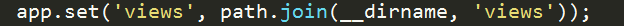

# NodeJS项目学习笔记 #
*距离用NodeJS成功搭建个人博客已经有好几个月了，这几天难得有空，好好看了一遍自己写的代码，整理出了一些基础但是对于我个人来说很重要的内容，希望可以帮助初学的同学，也让自己回顾的时候可以不那么费劲，毕竟人的记忆有限，久没接触很容易忘记。。。*

### — NodeJS创建项目的主要步骤
### — NodeJS文件夹解析
### — 如何进行文件上传
### — 注意事项

---
 

## NodeJS创建项目的主要步骤
### 1. 在Node官网上下载并安装好NodeJS
> * **地址：[https://nodejs.org/en/](https://nodejs.org/en/)**

### 2. 用包管理器安装全局的express框架
> * **npm install -g express**  
> 
> **注意：安装成功之后，使用express命令会提示“express不是内部或外部命令”，之所以会出现这个问题是因为4.X版本的express，把generator分离出来了，需要单独安装，因此运行另外再安装generator即可：**
>> * **npm install -g express-generator**

### 3. 创建一个NodeJS项目：
> * **在想要创建项目的目录下输入： express -e 项目名称**  
> **ps：-e参数代表使用的ejs模板，如果想用jade的话请使用-t**

### 4.启动mongoDB
**ps：可以使用其他的数据库，但推荐使用MongoDB**
> #### （1） 在MongoDB下载并安装好MongoDB
>> * **地址：[https://www.mongodb.com/](https://www.mongodb.com/)**
> #### （2） 在启动MongoDB的两种方法：
> **ps：（我的mongodb路径为：e:\html\mongoDB）**
>> * **方法1：**
>>> **先在mongoDB\bin下输入：mongod -dbpath "e:\html\mongoDB \data\db"，即可启动  mongodb**  
>>>
>>> **然后新打开一个命令行窗口，输入mongo或者mongo.exe  或者 直接打开mongo.exe**
>>
>> * **方法2（快速开启MongodDB的方法）：**
>>> **当mongod.exe被关闭时，mongo.exe就无法连接到数据库了，因此每次想要使用mongodb数据库都要开启mongod.exe程序，所以比较麻烦，此时我们可以将MongoDB安装为windows服务**  
>>>
>>> **在bin文件下执行下列命令：**  
>>> `>e:\html\mongoDB\bin>mongod --dbpath "e:\html\mongoDB\data\db --logpath "e:\html\mongoDB\log\MongoDB.log" --install --serviceName "MongoDB"`
>>> **--serviceName "MongoDB"即服务名为MongoDB**
>>>
>>> **接着即可启动mongodb服务：**
>>> `>e:\html\mongoDB\bin>NET START MongoDB`
>>>
>>> **关闭服务**
>>> `>e:\html\mongoDB\bin\>NET STOP MongoDB`
>>>
>>> **删除某个服务**
>>> `>e:\html\mongoDB\bin>mongod --dbpath "e:\html\mongoDB\data\db --logpath "e:\html\mongoDB\log\MongoDB.log" --remove --serviceName "MongoDB"`

### 5. 运行程序
> * **在当前项目目录下，运行下列命令： `node app.js`**

 
## NodeJS文件夹解析

> **由上图可得NodeJSD的文件结构，下面简单地说一下每个文件/文件夹的用处：**
> 
> * **app.js：程序入口**
> * **package.json：可在里面添加/删除程序所依赖的框架，添加/删除之后，用包管理器即可实现框架的下载/卸载（`npm install`）**
> * **node_modules：程序所依赖的框架全部存放在这个文件夹里面**
> * **public：里面自带三个文件夹，分别是：images、javascripts、stylesheets，分别存放程序所需的图片、js文件、css文件**
> * **routes：程序运行的核心部分，依赖它进行路由选择**
> * **views：存放视图模板**

 
## 如何进行文件上传
> #### 使用multer框架
> 
> 
> 
> * **destination用于指定保存的本地路径**
> * **filename用于指定保存的文件名**

> * **当上传单个文件时，使用single**
> 
> * **当上传多个文件时，使用array**
> 

 
## 注意事项
> #### 1. 路径问题
>> **NodeJS的路径跟普通的静态文件路径不同，它需要去定义一些静态路径才能访问到该文件夹：**
>> 
>
>> 
>> **正如上图所示，app.js里面定义了views文件夹和public文件夹的静态路径，因此我们可以直接调用views里面的视图模板和public文件夹里的具体文件，调用路径如下所示：**  
>> `views/index.ejs`  
>> `public/stylesheets/style.css`

 
---
*写了两个多小时，暂时先写这么多啦，又该去忙其他啦，下次想到其他再继续写，未完待续哟~*
