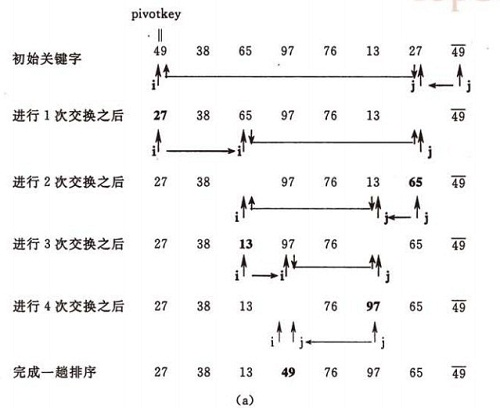

# 排序分类

*参考来源:
[九大排序算法](http://blog.csdn.net/xiazdong/article/details/8462393) 、
[八大排序算法](http://blog.csdn.net/hguisu/article/details/7776068)、
[快速排序百度百科](http://baike.baidu.com/link?url=UXJHwhoiBv2F_K-5wNnvMreBeSmENqYDAWC9Z7YFuDbq5FAJ3E-BAN_PpnBHSP-ZnJN43P_0PYSE6UJ5L-OuZ5W4RUJdfmsTNRmCGdSWEdpvI59LtN-8AVtdrJQ4cwaxG-IdFxap9dMHfL6iTfER5HsT0_lY_EW58SzL7tl16_xbStsfd2hd3tnw0gdof7tN#2)*

* #### In-place sort（不占用额外内存或占用常数的内存）：插入排序、选择排序、冒泡排序、堆排序、快速排序。
* #### Out-place sort：归并排序、计数排序、基数排序、桶排序。

* 当需要对大量数据进行排序时，In-place sort就显示出优点，因为只需要占用常数的内存。
* 设想一下，如果要对10000个数据排序，如果使用了Out-place sort，则假设需要用200G的额外空间，则一台老式电脑会吃不消，但是如果使用In-place sort，则不需要花费额外内存。

* #### stable sort：插入排序、冒泡排序、归并排序、计数排序、基数排序、桶排序。
* #### unstable sort：选择排序(5 8 5 2 9)、快速排序、堆排序。

### 为何排序的稳定性很重要？

在初学排序时会觉得稳定性有这么重要吗？两个一样的元素的顺序有这么重要吗？其实很重要。在基数排序中显得尤为突出，如下：

  

算法导论习题8.3-2说：如果对于不稳定的算法进行改进，使得那些不稳定的算法也稳定？  
* 其实很简单，只需要在每个输入元素加一个index，表示初始时的数组索引，当不稳定的算法排好序后，对于相同的元素对index排序即可。

---

## 1. 插入排序
** 特点：stable sort、In-place sort  **  
最优复杂度：当输入数组就是排好序的时候，复杂度为O(n)，而快速排序在这种情况下会产生O(n^2)的复杂度。  
最差复杂度：当输入数组为倒序时，复杂度为O(n^2)  
插入排序比较适合用于“少量元素的数组”。

其实插入排序的复杂度和逆序对的个数一样，当数组倒序时，逆序对的个数为n(n-1)/2，因此插入排序复杂度为O(n^2)。  
在算法导论2-4中有关于逆序对的介绍。

问：快速排序（不使用随机化）是否一定比插入排序快？
* 答：不一定，当输入数组已经排好序时，插入排序需要O(n)时间，而快速排序需要O(n^2)时间。

---

## 2. 冒泡排序
** 特点：stable sort、In-place sort  **  
思想：通过两两交换，像水中的泡泡一样，小的先冒出来，大的后冒出来。  
最坏运行时间：O(n^2)  
最佳运行时间：O(n^2)（当然，也可以进行改进使得最佳运行时间为O(n)）  
算法导论思考题2-2中介绍了冒泡排序。

在算法导论思考题2-2中又问了”冒泡排序和插入排序哪个更快“呢？
* 一般的人回答：“差不多吧，因为渐近时间都是O(n^2)”。  
但是事实上不是这样的，插入排序的速度直接是逆序对的个数，而冒泡排序中执行“交换“的次数是逆序对的个数，因此冒泡排序执行的时间至少是逆序对的个数，因此插入排序的执行时间至少比冒泡排序快。

---

## 3. 选择排序
** 特性：In-place sort，unstable sort。 **  
思想：每次找一个最小值。  
最好情况时间：O(n^2)。  
最坏情况时间：O(n^2)。  

算法导论2.2-2中问了"为什么伪代码中第3行只有循环n-1次而不是n次"？
* 在循环不变式证明中也提到了，如果A[1...n-1]已排序，且包含了A中最小的n-1个元素，则A[n]肯定是最大的，因此肯定是已排序的。

---

## 4. 希尔排序
基本思想：  
* 先将整个待排序的记录序列分割成为若干子序列分别进行直接插入排序，待整个序列中的记录“基本有序”时，再对全体记录进行依次直接插入排序。

操作方法：  
* 选择一个增量序列t1，t2，…，tk，其中ti>tj，tk=1；  
* 按增量序列个数k，对序列进行k 趟排序；
* 每趟排序，根据对应的增量ti，将待排序列分割成若干长度为m 的子序列，分别对各子表进行直接插入排序。仅增量因子为1 时，整个序列作为一个表来处理，表长度即为整个序列的长度。

算法实现：
* 我们简单处理增量序列：增量序列d = {n/2 ,n/4, n/8 .....1} n为要排序数的个数   
即：先将要排序的一组记录按某个增量d（n/2,n为要排序数的个数）分成若干组子序列，每组中记录的下标相差d.对每组中全部元素进行直接插入排序，然后再用一个较小的增量（d/2）对它进行分组，在每组中再进行直接插入排序。继续不断缩小增量直至为1，最后使用直接插入排序完成排序。

---

## 5. 快速排序
基本思想：
1. 选择一个基准元素,通常选择第一个元素或者最后一个元素,

2. 通过一趟排序讲待排序的记录分割成独立的两部分，其中一部分记录的元素值均比基准元素值小。另一部分记录的 元素值比基准值大。

3. 此时基准元素在其排好序后的正确位置

4. 然后分别对这两部分记录用同样的方法继续进行排序，直到整个序列有序。

假设用户输入了如下数组：

创建变量i=0（指向第一个数据）, j=5(指向最后一个数据), k=6(赋值为第一个数据的值)。  

我们要把所有比k小的数移动到k的左面，所以我们可以开始寻找比6小的数，从j开始，从右往左找，不断递减变量j的值，我们找到第一个下标3的数据比6小，于是把数据3移到下标0的位置，把下标0的数据6移到下标3，完成第一次比较：

i=0 j=3 k=6  

接着，开始第二次比较，这次要变成找比k大的了，而且要从前往后找了。递加变量i，发现下标2的数据是第一个比k大的，于是用下标2的数据7和j指向的下标3的数据的6做交换，数据状态变成下表：

i=2 j=3 k=6  

称上面两次比较为一个循环。

接着，再递减变量j，不断重复进行上面的循环比较。  

在本例中，我们进行一次循环，就发现i和j“碰头”了：他们都指向了下标2。于是，第一遍比较结束。得到结果如下，凡是k(=6)左边的数都比它小，凡是k右边的数都比它大：

如果i和j没有碰头的话，就递加i找大的，还没有，就再递减j找小的，如此反复，不断循环。注意判断和寻找是同时进行的。  

然后，对k两边的数据，再分组分别进行上述的过程，直到不能再分组为止。

** 注意 ** ：第一遍快速排序不会直接得到最终结果，只会把比k大和比k小的数分到k的两边。为了得到最后结果，需要再次对下标2两边的数组分别执行此步骤，然后再分解数组，直到数组不能再分解为止（只有一个数据），才能得到正确结果。

##### （a）一趟排序的过程：

##### （b）排序的全过程

